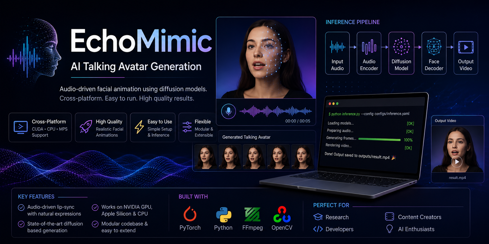

# EchoMimic-MPS

<p align="center">
  
</p>

> Apple Silicon (MPS) compatibility layer for EchoMimic with dynamic device selection and macOS support.

---

## Overview

EchoMimic-MPS is an adaptation of the original EchoMimic project that enables inference on Apple Silicon Macs using Metal Performance Shaders (MPS).

The goal of this repository is to make the project executable on macOS by replacing CUDA-specific operations with device-aware implementations while preserving the original inference pipeline.

---

## Original Project

This repository is based on **EchoMimic: Lifelike Audio-Driven Portrait Animations through Editable Landmark Conditioning** by the EchoMimic research team. The original implementation, paper, models, and research remain the work of the original authors. :contentReference[oaicite:0]{index=0}

Original Repository:
https://github.com/antgroup/echomimic

Research Paper:
https://arxiv.org/abs/2407.08136

---

# What I Changed

This repository contains engineering modifications required to execute EchoMimic on Apple Silicon.

### Device Support

- Added Apple Silicon (MPS) support
- Dynamic CUDA / MPS / CPU selection
- Automatic device detection
- Device-aware checkpoint loading

### Pipeline Changes

- Removed CUDA-only tensor allocation
- Updated inference pipeline
- Updated WebUI
- Added custom image support
- Added custom audio support

### Compatibility Improvements

- FP32 execution for MPS
- Fixed device mismatch issues
- Updated configuration files
- Improved macOS compatibility

---

# Features

- Apple Silicon (MPS)
- CUDA Support
- CPU Fallback
- Custom Portrait Images
- Custom Audio
- Talking Avatar Generation
- Automatic Face Detection
- Diffusion-based Animation

---

# Repository Structure

```text
EchoMimic-MPS
│
├── assets/
├── configs/
├── pretrained_weights/
├── src/
├── infer_audio2vid.py
├── webgui.py
├── README.md
└── requirements.txt
```

---

# Running

```bash
python infer_audio2vid.py --device mps
```

---

# Tested Environment

| Component | Version |
|-----------|----------|
| macOS | Tested |
| Python | 3.10 |
| PyTorch | 2.2 |
| Apple Silicon | MPS |

---

# Known Limitation

Inference on Apple Silicon is functional but considerably slower than execution on NVIDIA CUDA GPUs because diffusion workloads are not yet equally optimized for MPS.

---

# Acknowledgements

All research credit belongs to the original EchoMimic authors.

This repository focuses on improving compatibility for Apple Silicon devices and does not claim ownership of the original model, research, or training methodology.

---

# Author

**Arockia Parithie A**

AI & Data Science Engineer

GitHub:
https://github.com/Parithie311

LinkedIn:
https://linkedin.com/in/parithie-a-23562b265
