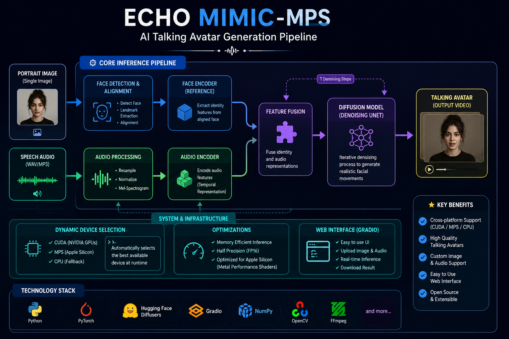

# EchoMimic-MPS

<p align="center">
  
</p>

<p align="center">
  
  
  
  
</p>

# EchoMimic-MPS

> AI Talking Avatar Generation
> Apple Silicon (MPS) compatibility layer for EchoMimic with dynamic device selection and macOS support.

---

## Overview

## 🚀 Project Highlights

- 🎙️ Generate realistic talking avatars from a single image and speech audio.
- 🧠 Diffusion-based facial animation pipeline.
- 🖼️ Supports custom portrait images.
- 🎵 Supports custom speech audio.
- ⚙️ Dynamic device selection (CUDA, MPS, CPU).
- 🌐 Interactive Gradio Web Interface.
- 🔧 Cross-platform compatibility improvements.

---

## Original Project

This repository is based on **EchoMimic: Lifelike Audio-Driven Portrait Animations through Editable Landmark Conditioning** by the EchoMimic research team. The original implementation, paper, models, and research remain the work of the original authors. :contentReference[oaicite:0]{index=0}

Original Repository:
https://github.com/antgroup/echomimic

Research Paper:
https://arxiv.org/abs/2407.08136

---

# What I Changed

This repository contains engineering modifications required to execute EchoMimic on Apple Silicon.


## 🎥 Demo

> **Coming Soon**

A demo GIF and sample output videos will be added to showcase the complete talking avatar generation pipeline.


### Device Support

- Added Apple Silicon (MPS) support
- Dynamic CUDA / MPS / CPU selection
- Automatic device detection
- Device-aware checkpoint loading

### Pipeline Changes

- Removed CUDA-only tensor allocation
- Updated inference pipeline
- Updated WebUI
- Added custom image support
- Added custom audio support

### Compatibility Improvements

- FP32 execution for MPS
- Fixed device mismatch issues
- Updated configuration files
- Improved macOS compatibility

---

# Features

- Apple Silicon (MPS)
- CUDA Support
- CPU Fallback
- Custom Portrait Images
- Custom Audio
- Talking Avatar Generation
- Automatic Face Detection
- Diffusion-based Animation

---


## 🏗️ Architecture

<p align="center">
  
</p>

<p align="center">
  End-to-end AI talking avatar generation pipeline showing image encoding, audio processing, feature fusion, diffusion inference, and cross-platform execution.
</p>

---
```

---

# Running

```bash
python infer_audio2vid.py --device mps
```

---

# Tested Environment

| Component | Version |
|-----------|----------|
| macOS | Tested |
| Python | 3.10 |
| PyTorch | 2.2 |
| Apple Silicon | MPS |

---

# Known Limitation

Inference on Apple Silicon is functional but considerably slower than execution on NVIDIA CUDA GPUs because diffusion workloads are not yet equally optimized for MPS.

---

# Acknowledgements

All research credit belongs to the original EchoMimic authors.

This repository focuses on improving compatibility for Apple Silicon devices and does not claim ownership of the original model, research, or training methodology.

---

# Author

**Arockia Parithie A**

AI & Data Science Engineer

GitHub:
https://github.com/Parithie311

LinkedIn:
https://linkedin.com/in/parithie-a-23562b265
